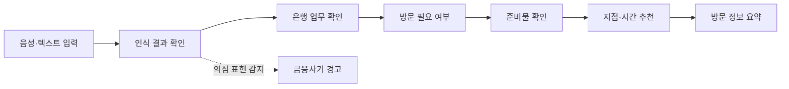

# 어부바

> 어르신 부담 바로 덜기

어부바는 사용자가 은행 업무를 평소 쓰는 말로 설명하면 방문 필요 여부와 준비물, 방문할 지점과 추천 시간을 차례로 안내하는 시니어 친화형 웹 서비스입니다.

이 저장소는 음성·텍스트 입력부터 방문 정보 요약까지의 화면 흐름, 전역 상태 관리, Backend API 연동과 Kakao Maps 기반 지점 표시를 담당하는 Vue 3 프론트엔드입니다.

[서비스 바로가기](https://eobuba-frontend.vercel.app) · [Organization](https://github.com/eobuba-official) · [Backend](https://github.com/eobuba-official/backend)

## 주요 기능

| 기능 | 설명 |
| --- | --- |
| 음성·텍스트 입력 | 사용자의 요청을 음성 또는 직접 입력으로 전달합니다. |
| 인식 결과 확인 | 음성 인식 결과를 확인하고 다시 말하거나 직접 수정할 수 있습니다. |
| 은행 업무 확인 | 분석된 업무와 후보를 보여주고 사용자가 최종 업무를 선택합니다. |
| 방문 필요 여부 안내 | 선택한 업무가 은행 방문이 필요한 업무인지 안내합니다. |
| 준비물 체크리스트 | 사용자 조건에 맞는 준비물을 질문하고 체크리스트로 제공합니다. |
| 지점·시간 추천 | 업무 처리 가능 여부, 거리와 예상 대기시간을 기준으로 후보를 보여줍니다. |
| 지도 확인 | Kakao Maps를 통해 추천 지점의 위치와 방문 정보를 표시합니다. |
| 금융사기 경고 | 의심 표현이 감지되면 일반 안내를 중단하고 경고 화면을 우선 표시합니다. |

## 화면 흐름



## Tech Stack

| Category | Technologies |
| --- | --- |
| Core |    |
| State · Routing |   |
| API · Map |   |
| Test · Quality |    |
| Deploy |  |

## 시작하기

### 요구 사항

- Node.js `^22.18.0` 또는 `>=24.12.0` (`package.json` 기준)
- npm
- Kakao Maps JavaScript 키
- 어부바 Backend API

### 환경 변수

`.env.example`을 복사해 `.env.local`을 만들고 값을 설정합니다.

```env
VITE_API_BASE_URL=/api/v1
VITE_KAKAO_MAP_KEY=YOUR_KAKAO_MAP_KEY
```

### 설치 및 실행

```bash
npm install
npm run dev
```

개발 서버는 기본적으로 `http://localhost:5173`에서 실행됩니다.

## 명령어

| 명령어 | 설명 |
| --- | --- |
| `npm run dev` | 개발 서버 실행 |
| `npm run build` | 타입 검사 후 프로덕션 빌드 |
| `npm run preview` | 빌드 결과 미리보기 |
| `npm run type-check` | TypeScript 타입 검사 |
| `npm run test:unit` | Vitest 단위 테스트 |
| `npm run lint` | Oxlint와 ESLint 검사 및 자동 수정 |
| `npm run format` | Prettier 코드 포맷팅 |

## 프로젝트 구조

```text
src/
├── api/          # API 클라이언트와 요청·응답 타입
├── assets/       # 이미지와 공통 스타일
├── components/   # 공통 UI 컴포넌트
├── mocks/        # 지점 추천 실패 시 사용하는 대체 데이터
├── router/       # 화면 경로와 라우팅 가드
├── services/     # 인증·상담·음성 API 연동
├── stores/       # Pinia 전역 상태
├── utils/        # 권한·지도 등 공통 유틸리티
└── views/        # 서비스 화면
```
